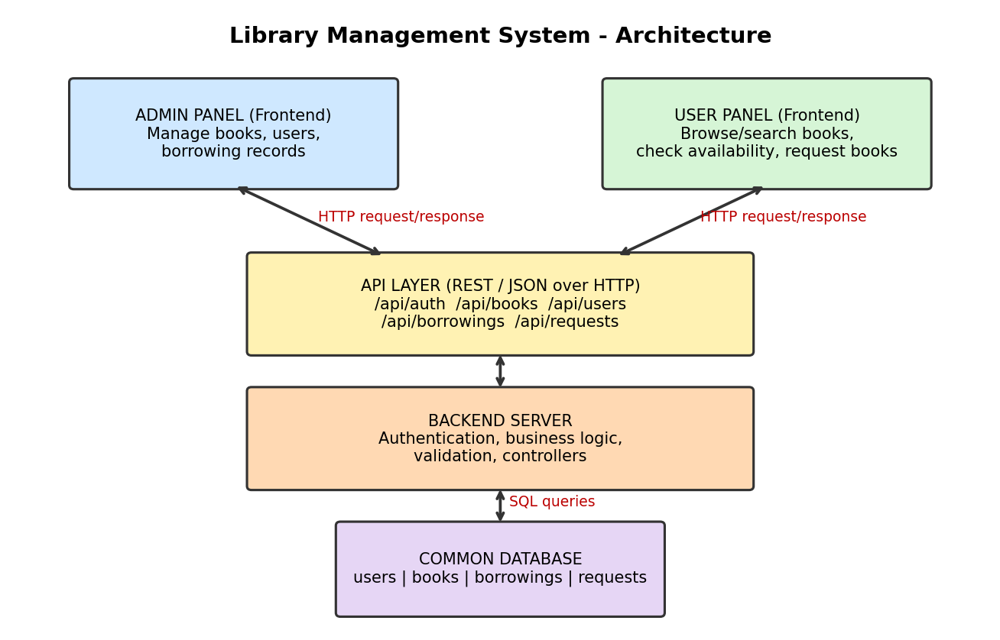

# Library Management System

A full-stack Library Management System with two separate frontends (Admin Panel and User Panel) that talk to one shared backend through REST APIs and use a common database.

> Assignment 1: architecture design and repository setup (no working application required).

## Architecture



| Component | Role |
|---|---|
| **Admin Panel** (`admin-panel/`) | Manage books, users and borrowing records |
| **User Panel** (`user-panel/`) | Browse/search books, check availability, request books |
| **Backend API** (`backend/`) | Business logic, authentication, validation, REST endpoints |
| **Database** (`database/`) | Common storage: users, books, borrow records, requests |

Both panels send HTTP requests (JSON over REST) to the same backend. Only the backend talks to the database.

## Project Structure

```
library-management-system/
├── admin-panel/        # Admin frontend
│   └── src/
├── user-panel/         # User frontend
│   └── src/
├── backend/            # API server
│   └── src/
│       ├── routes/
│       ├── controllers/
│       └── models/
├── database/           # Schema / seed files
├── docs/               # Diagram and answers
├── .gitignore
└── README.md
```

## Planned API Endpoints

| Method | Endpoint | Used by | Purpose |
|---|---|---|---|
| POST | `/api/auth/login` | Both | Login |
| GET | `/api/books` | Both | List / search books |
| GET | `/api/books/:id` | Both | Book details and availability |
| POST | `/api/books` | Admin | Add book |
| PUT | `/api/books/:id` | Admin | Update book |
| DELETE | `/api/books/:id` | Admin | Remove book |
| GET/POST | `/api/users` | Admin | Manage users |
| GET/POST | `/api/borrowings` | Admin | Manage borrowing records |
| POST | `/api/requests` | User | Request a book |

## Planned Tech Stack
React (both frontends), Node.js + Express (backend), PostgreSQL/MySQL (database).

## Author
Your Name - Roll No.
